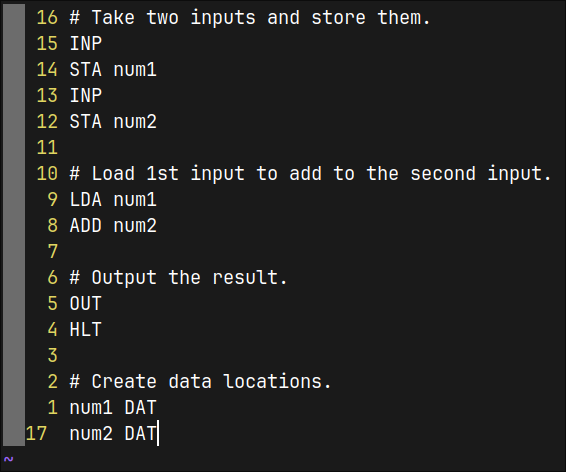

# Little Man Computer (LMC)

* A simple CLI Little Man Computer (LMC) emulator.

# Prerequisites

* Git
* GCC (or any C++ compiler)
* CMake

## Example Commands on Linux to Install Prerequisites

### Debian Based Distros (Debian, Ubuntu, Linux Mint etc.)

``` Bash
sudo apt install git g++ cmake build-essential
```

### Arch Based Distros (Arch, Manjaro etc.) 

``` Bash
sudo pacman -S git base-devel cmake
```

# Build Instructions

* Open a terminal.
* Go to a directory where you want clone this repo.
* Create a build directory to build using CMake.

* The commands for this are listed below.
* Enter these commands one by one. (On Windows, use '\\' instead of '/' e.g. `cd lmc\`)

```
git clone https://github.com/LanzoMA/lmc.git
cd lmc/
mkdir build/
cd build/
cmake ../
```

# How to Use

* You should see a 'main.txt' file in the 'lmc' folder.
* This should contain example LMC code:



* This is code for adding two numbers and outputting their total.

* To Test, place the main.txt file next to the executable (lmc)
* Run the executable ./lmc (or .\lmc.exe on Windows)

# Limitations

* This emulator is NOT a good tool for explaining LMC and the basics of assembly.

## *Very Important*

**Labels, opcodes and operands must have a single space between them.** e.g. 

``` LMC
loop BRP end
```

* No vizualizations of the registers.
* Not currently able to change the 'clock speed' to slow down execution.
* The accumulator, MDR, MAR and RAM locations can store numbers larger than 3 digits.

